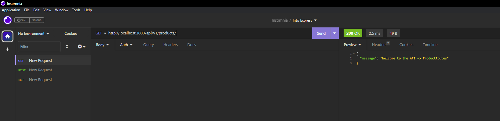
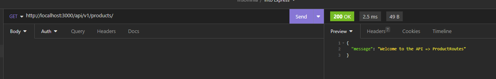

#  Backend

1. Crear la carpeta.

2. Entrar a la carpeta. ``cd 4.4.1/backend``.

3. Inicializar el proyecto `npm init -y`.

4. Añadir el ``.gitignore`` con la linea 
    ```
    node_modules/
    ```
5. Crear nuestro servidor:
    1. Instalar `express`  => `npm i express`; permite a instalar el recurso necesario para ejecutar la creacion de mi api
    2. Crear el código base para una API con express:
    ```
        const express = require('express');
        const server = express();
        const port = 3000;

        server.listen(port, () => {
        console.log(`API escuchando en puerto ${port}.`);
        });
    ```
    
    3. Probar que nuestra API esté lista, levantando el servidor, escribiendo en la terminal:
        - `node server.js` || `nodemon server.js`
        1. Si requieres no instalar nodemon podemos agregarlo a un script.
            - Requieres agregarlo a un script en el package.json:
            - Vamos al package.json y agregamos el script `dev`
            - Agregamos un script:
                ```
                Antes:
                "scripts": {
                    "test": "echo \"Error: no test specified\" && exit 1",
                    "start": "node server.js"
                }
                ```
                ```
                Despues:
                "scripts": {
                    "test": "echo \"Error: no test specified\" && exit 1",
                    "start": "node server.js",
                    "dev": "nodemon server.js"
                },
                ```
            - Y para ejecutarlo en la terminal correremos:
                - `npm run nombreDelScript` => `npm run dev`.
            - Si no te reconoce `nodemon`, instalalo con `npm i -D nodemon`.
    4. Lo que sigue es crear el arbol de carpetas para mi arquitectura.
    nota: se puede utilizar npm i e instalra todo lo que hay en package json
    
    la resfull API HTT URL esta con el nombre server.js
    

    5. Es empezar llenando loas archivos de rutas con la estrucutra básica.

        ```
        const express = require('express');
        const router = express.Router();

        router.get('/', () => {});

        module.exports = router;
        ```
    6. Importamos en el index.js de la carpeta `routes` a todos.

    ```
        const ClientRoutes = require('./ClientRoutes');
        const ProductRoutes = require('./ProductRoutes');
        const SaleRoutes = require('./SaleRoutes');

        module.exports = {
            ClientRoutes,
            ProductRoutes,
            SaleRoutes,
        };
    ```
    el camino que se sigues es tienemos un archivo server.js  que llama a un archivo index,js en routes y este llama a un archivo ClientRoutes o ProductRoutes o SaleRoutes
    7. Importemoslos a la App.
    

    se prueba en insomia el status 
    
    

    ese ultimo / lo pone en cada productroutes o clinetroutes o saleroutes
    
    8.
